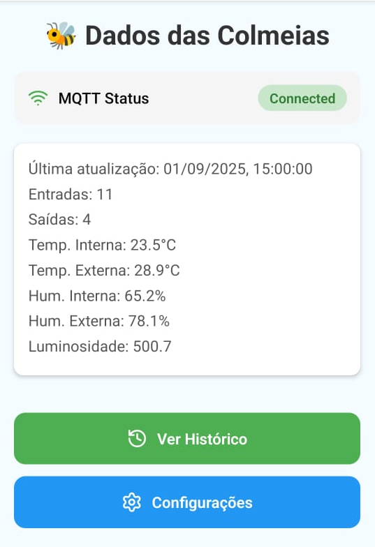
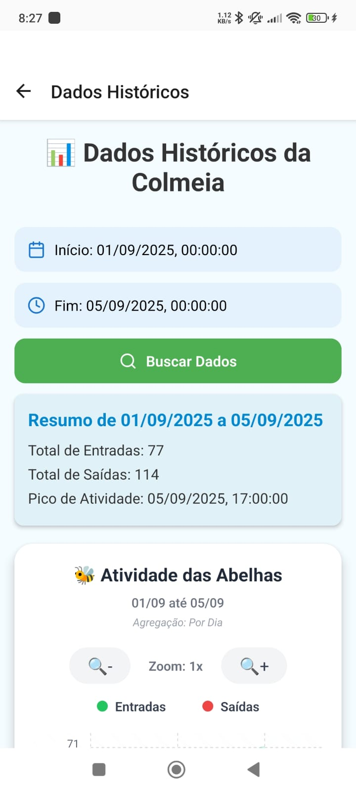
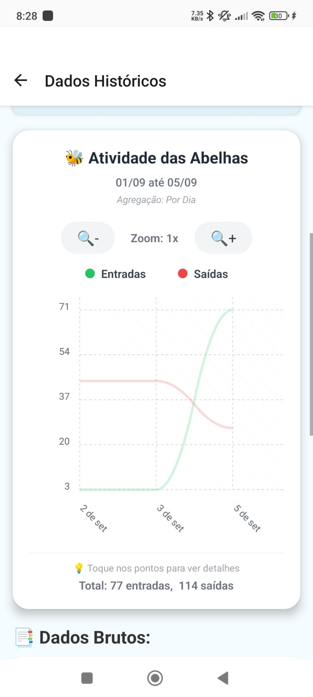
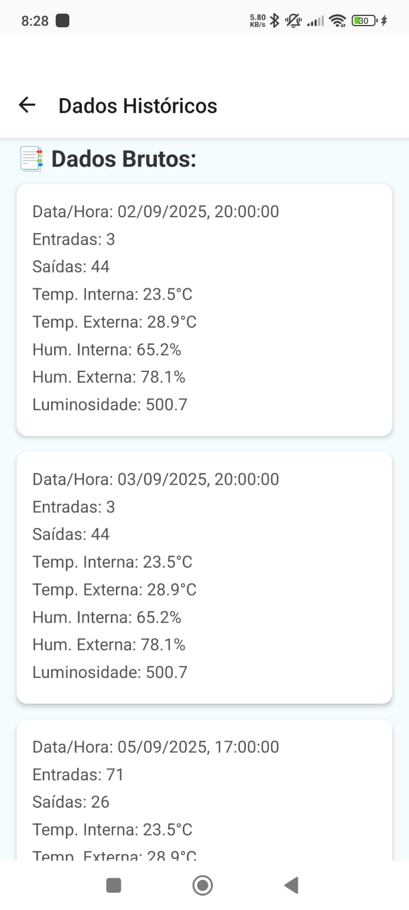
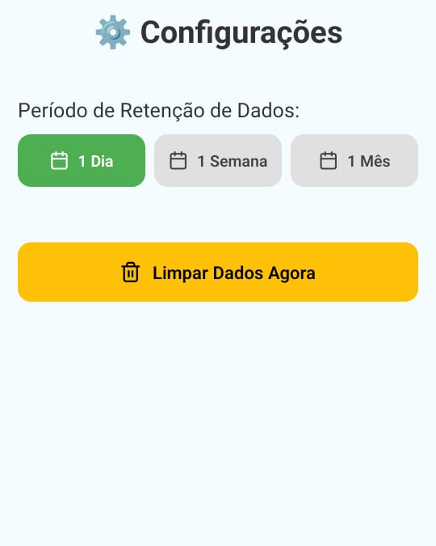

# 🐝 Sistema IoT de Monitoramento de Colmeias

Este repositório contém o projeto **Sistema IoT de Monitoramento de Colmeias**, desenvolvido como uma solução tecnológica para auxiliar apicultores no acompanhamento remoto e inteligente das colônias de abelhas.  
O sistema integra **módulo embarcado**, **backend distribuído** e **aplicativo móvel**, promovendo a gestão eficiente das colmeias por meio de **Internet das Coisas (IoT)**.

---

## 📋 Resumo

A apicultura enfrenta desafios relacionados a mudanças climáticas, uso de pesticidas e doenças que comprometem a saúde das colônias. O projeto propõe um **sistema IoT** capaz de:

- Coletar dados de temperatura, umidade, luminosidade e fluxo de abelhas;
- Transmitir informações em tempo real para um backend;
- Disponibilizar os dados em **aplicativo móvel** com dashboards, gráficos e histórico.

---

## ⚙️ Arquitetura do Sistema

O sistema é composto por três módulos principais:

1. **Módulo de Aquisição de Dados (hardware)**
   - Sensores de temperatura, umidade, luminosidade e fluxo de abelhas;
   - Microcontroladores **ATmega328P** e **ESP8266**;
   - Transmissão via **HTTP POST (JSON)** para o backend.

2. **Backend**
   - Desenvolvido em **Java (Spring Framework)**;
   - Armazena os dados em **MongoDB**;
   - Publica dados em tempo real via **MQTT (HiveMQ broker público)**.

3. **Aplicativo Móvel**
   - Desenvolvido em **React Native**;
   - Consome dados em tempo real via **MQTT**;
   - Armazena histórico local em **SQLite**;
   - Dashboards e gráficos interativos;

---

## 📱 Funcionalidades do Aplicativo

- Exibição de dados em **tempo real**;
- Histórico de entradas/saídas de abelhas;
- **Gráficos de linha** (verde = entradas | vermelho = saídas);
- Notificações locais para monitoramento preventivo;
- Armazenamento local com **políticas de retenção** configuráveis.

---

## 🚀 Tecnologias Utilizadas

- **Hardware:** ATmega328P, ESP8266, sensores ambientais;
- **Backend:** Java, Spring Framework, MongoDB, MQTT;
- **Aplicativo Mobile:** React Native, SQLite;
- **Comunicação:** HTTP (JSON), MQTT.
